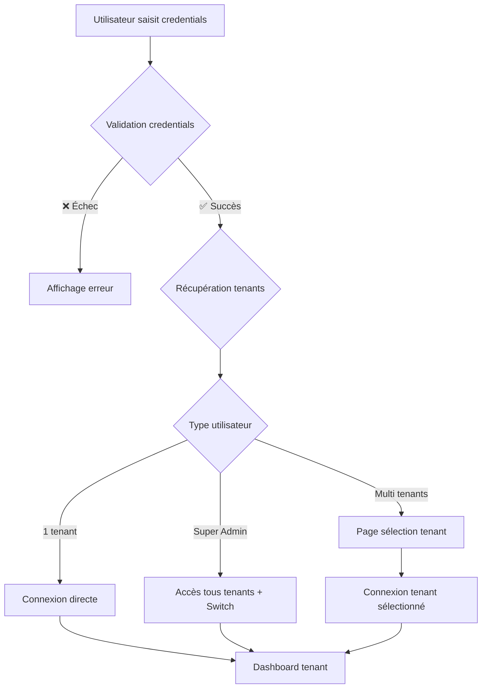

# 🔐 Système de Connexion et Gestion Multi-Tenant - Impact Auto

## 📋 Table des Matières

1. [Vue d'ensemble](#vue-densemble)
2. [Architecture de Connexion](#architecture-de-connexion)
3. [Types d'Utilisateurs](#types-dutilisateurs)
4. [Interface de Connexion](#interface-de-connexion)
5. [Gestion des Sessions](#gestion-des-sessions)
6. [Sécurité et Isolation](#sécurité-et-isolation)
7. [Implémentation Technique](#implémentation-technique)
8. [Interface Utilisateur](#interface-utilisateur)
9. [Avantages](#avantages)

---

## 🎯 Vue d'ensemble

Le système de connexion multi-tenant d'**Impact Auto** permet une gestion flexible et sécurisée des accès utilisateurs selon leur rôle et leurs affectations tenant.

### **Principe de Fonctionnement**
- **Utilisateur standard** : Accès à ses tenants assignés uniquement
- **Administrateur tenant** : Gestion complète de son tenant
- **Super administrateur** : Accès à tous les tenants avec possibilité de switch

---

## 🏗️ Architecture de Connexion

### **1. Flux de Connexion**



### **2. Structure des Sessions**

```php
// Session utilisateur Impact Auto
$_SESSION = [
    'user_id' => 123,
    'current_tenant_id' => 1,
    'available_tenants' => [1, 2, 3],
    'is_admin' => true,
    'can_switch_tenants' => true,
    'user_type' => 'super_admin',
    'permissions' => ['all'],
    'last_activity' => '2025-01-27 10:30:00'
];
```

---

## 👥 Types d'Utilisateurs

### **1. Utilisateur Standard**
```php
'user_type' => 'standard',
'tenants' => [1, 2], // Tenants assignés uniquement
'can_switch' => false,
'permissions' => ['read', 'write'] // Selon rôle Collaborateur
```

### **2. Administrateur Tenant**
```php
'user_type' => 'tenant_admin',
'tenants' => [1], // Tenant principal
'can_switch' => false,
'permissions' => ['manage_users', 'manage_vehicles', 'manage_interventions']
```

### **3. Super Administrateur**
```php
'user_type' => 'super_admin',
'tenants' => 'all', // Tous les tenants
'can_switch' => true,
'permissions' => ['all']
```

---

## 🖥️ Interface de Connexion

### **1. Page de Connexion Standard**

```html
┌─────────────────────────────────────┐
│ 🔐 Connexion - Impact Auto          │
├─────────────────────────────────────┤
│                                     │
│ Email: [________________]           │
│ Mot de passe: [____________]        │
│                                     │
│ [Se souvenir de moi]                │
│                                     │
│ [Se connecter]                      │
│                                     │
└─────────────────────────────────────┘
```

### **2. Page de Sélection de Tenant**

```html
┌─────────────────────────────────────┐
│ 🏢 Choisir votre organisation       │
├─────────────────────────────────────┤
│                                     │
│ Bonjour Jean Dupont                 │
│                                     │
│ Sélectionnez votre organisation:    │
│                                     │
│ ○ Flotte Alpha                      │
│   (Votre organisation principale)   │
│                                     │
│ ○ Logistique Beta                   │
│   (Organisation secondaire)         │
│                                     │
│ ○ Transport Gamma                   │
│   (Organisation partenaire)         │
│                                     │
│ [Continuer]                         │
│                                     │
└─────────────────────────────────────┘
```

### **3. Interface de Switch Tenant (Admin)**

```html
┌─────────────────────────────────────┐
│ 🏢 Switch Tenant (Admin)            │
├─────────────────────────────────────┤
│                                     │
│ Tenant actuel: Flotte Alpha         │
│                                     │
│ Autres tenants disponibles:         │
│                                     │
│ • Logistique Beta                   │
│   (150 véhicules, 25 utilisateurs)  │
│                                     │
│ • Transport Gamma                   │
│   (75 véhicules, 12 utilisateurs)   │
│                                     │
│ • Construction Delta                │
│   (200 véhicules, 40 utilisateurs)  │
│                                     │
│ [Changer de tenant]                 │
│                                     │
└─────────────────────────────────────┘
```

---

## 🔒 Gestion des Sessions

### **1. Middleware de Tenant**

```php
class TenantMiddleware {
    public function handle($request, $next) {
        // Vérifier si l'utilisateur est connecté
        if (!Auth::check()) {
            return redirect('/login');
        }
        
        // Récupérer le tenant actuel
        $currentTenantId = session('current_tenant_id');
        
        if (!$currentTenantId) {
            return $this->redirectToTenantSelection();
        }
        
        // Vérifier l'accès au tenant
        if (!Auth::user()->canAccessTenant($currentTenantId)) {
            return $this->redirectToTenantSelection();
        }
        
        // Définir le tenant dans le contexte
        app()->instance('current_tenant', Tenant::find($currentTenantId));
        
        return $next($request);
    }
}
```

### **2. Service d'Authentification**

```php
class AuthenticationService {
    public function login($email, $password) {
        // 1. Vérifier les credentials
        $user = $this->validateCredentials($email, $password);
        
        // 2. Récupérer les tenants associés
        $tenants = $this->getUserTenants($user->getId());
        
        // 3. Déterminer le type de connexion
        if ($user->isSuperAdmin()) {
            return $this->handleSuperAdminLogin($user, $tenants);
        } elseif (count($tenants) === 1) {
            return $this->handleSingleTenantLogin($user, $tenants[0]);
        } else {
            return $this->handleMultiTenantLogin($user, $tenants);
        }
    }
    
    public function switchTenant($userId, $tenantId) {
        // Vérifier les permissions
        if (!$this->canUserAccessTenant($userId, $tenantId)) {
            throw new UnauthorizedException();
        }
        
        // Mettre à jour la session
        $_SESSION['current_tenant_id'] = $tenantId;
        
        // Rediriger vers le dashboard du tenant
        return $this->redirectToTenantDashboard($tenantId);
    }
}
```

---

## 🛡️ Sécurité et Isolation

### **1. Matrice de Permissions**

|                    | Standard | Tenant Admin | Super Admin |
|--------------------|----------|--------------|-------------|
| Voir ses tenants   |    ✅    |      ✅      |     ✅      |
| Switcher tenant    |    ❌    |      ❌      |     ✅      |
| Gérer utilisateurs |    ❌    |      ✅      |     ✅      |
| Accès système      |    ❌    |      ❌      |     ✅      |
| Voir tous tenants  |    ❌    |      ❌      |     ✅      |

### **2. Vérifications de Sécurité**

```php
// Vérifier l'accès au tenant
public function canAccessTenant($userId, $tenantId) {
    $user = User::find($userId);
    
    if ($user->isSuperAdmin()) {
        return true; // Super admin peut accéder à tout
    }
    
    return $user->tenants()->where('tenant_id', $tenantId)->exists();
}

// Vérifier les permissions dans le tenant
public function hasPermissionInTenant($userId, $tenantId, $permission) {
    $collaborateur = Collaborateur::where('user_id', $userId)
        ->whereHas('tenants', function($query) use ($tenantId) {
            $query->where('tenant_id', $tenantId);
        })->first();
    
    return $collaborateur && $collaborateur->hasPermission($permission);
}
```

### **3. Isolation des Données**

```php
// Toutes les requêtes incluent le tenant_id
class VehicleController {
    public function index() {
        $tenantId = session('current_tenant_id');
        
        $vehicles = Vehicle::where('tenant_id', $tenantId)->get();
        
        return view('vehicles.index', compact('vehicles'));
    }
}
```

---

## 🔧 Implémentation Technique

### **1. Gestion des URLs Multi-Tenant**

#### **A. Structure des URLs**
```
// URLs par sous-domaine (recommandé)
https://tenant1.impact-auto.com/dashboard
https://tenant2.impact-auto.com/dashboard
https://admin.impact-auto.com/tenants

// URLs par path
https://impact-auto.com/tenant1/dashboard
https://impact-auto.com/tenant2/dashboard
https://impact-auto.com/admin/tenants
```

#### **B. Routage Dynamique**
```php
// Routes par tenant
Route::group(['domain' => '{tenant}.impact-auto.com'], function() {
    Route::get('/dashboard', 'DashboardController@index');
    Route::get('/vehicles', 'VehicleController@index');
    Route::get('/interventions', 'InterventionController@index');
});

// Routes admin
Route::group(['domain' => 'admin.impact-auto.com'], function() {
    Route::get('/tenants', 'TenantController@index');
    Route::post('/switch-tenant', 'TenantController@switch');
});
```

### **2. Base de Données**

#### **A. Table des Sessions**
```sql
CREATE TABLE user_sessions (
    id INT PRIMARY KEY AUTO_INCREMENT,
    user_id INT NOT NULL,
    tenant_id INT,
    session_token VARCHAR(255) UNIQUE,
    is_admin BOOLEAN DEFAULT FALSE,
    can_switch_tenants BOOLEAN DEFAULT FALSE,
    last_activity TIMESTAMP DEFAULT CURRENT_TIMESTAMP,
    created_at TIMESTAMP DEFAULT CURRENT_TIMESTAMP,
    FOREIGN KEY (user_id) REFERENCES users(id),
    FOREIGN KEY (tenant_id) REFERENCES tenants(id)
);
```

#### **B. Table des Permissions Tenant**
```sql
CREATE TABLE user_tenant_permissions (
    id INT PRIMARY KEY AUTO_INCREMENT,
    user_id INT NOT NULL,
    tenant_id INT NOT NULL,
    permissions JSON,
    is_primary BOOLEAN DEFAULT FALSE,
    created_at TIMESTAMP DEFAULT CURRENT_TIMESTAMP,
    FOREIGN KEY (user_id) REFERENCES users(id),
    FOREIGN KEY (tenant_id) REFERENCES tenants(id),
    UNIQUE KEY unique_user_tenant (user_id, tenant_id)
);
```

---

## 🎨 Interface Utilisateur

### **1. Sélecteur de Tenant (Admin)**

```vue
<template>
  <div class="tenant-selector">
    <select v-model="selectedTenant" @change="switchTenant">
      <option value="">Sélectionner un tenant</option>
      <option 
        v-for="tenant in availableTenants" 
        :key="tenant.id" 
        :value="tenant.id"
      >
        {{ tenant.name }} ({{ tenant.vehicle_count }} véhicules)
      </option>
    </select>
  </div>
</template>

<script>
export default {
  data() {
    return {
      selectedTenant: '',
      availableTenants: []
    }
  },
  methods: {
    async switchTenant() {
      if (this.selectedTenant) {
        await this.$http.post('/api/switch-tenant', {
          tenant_id: this.selectedTenant
        });
        this.$router.push('/dashboard');
      }
    }
  }
}
</script>
```

### **2. Indicateur de Tenant Actuel**

```vue
<template>
  <div class="current-tenant">
    <i class="fas fa-building"></i>
    <span>{{ currentTenant.name }}</span>
    <i class="fas fa-chevron-down" v-if="canSwitch"></i>
  </div>
</template>

<script>
export default {
  computed: {
    currentTenant() {
      return this.$store.state.currentTenant;
    },
    canSwitch() {
      return this.$store.state.user.can_switch_tenants;
    }
  }
}
</script>
```

### **3. Barre de Navigation**

```vue
<template>
  <nav class="navbar">
    <div class="navbar-brand">
      
      <span class="brand-name">Impact Auto</span>
    </div>
    
    <div class="navbar-menu">
      <div class="navbar-start">
        <a class="navbar-item" href="/dashboard">Dashboard</a>
        <a class="navbar-item" href="/vehicles">Véhicules</a>
        <a class="navbar-item" href="/interventions">Interventions</a>
      </div>
      
      <div class="navbar-end">
        <div class="navbar-item">
          <tenant-selector v-if="canSwitch" />
          <span v-else class="current-tenant">
            <i class="fas fa-building"></i>
            {{ currentTenant.name }}
          </span>
        </div>
        
        <div class="navbar-item">
          <div class="dropdown">
            <div class="dropdown-trigger">
              <button class="button">
                <span>{{ user.first_name }}</span>
                <i class="fas fa-chevron-down"></i>
              </button>
            </div>
            <div class="dropdown-menu">
              <div class="dropdown-content">
                <a class="dropdown-item" href="/profile">Profil</a>
                <a class="dropdown-item" href="/settings">Paramètres</a>
                <hr class="dropdown-divider">
                <a class="dropdown-item" href="/logout">Déconnexion</a>
              </div>
            </div>
          </div>
        </div>
      </div>
    </div>
  </nav>
</template>
```

---

## ✅ Avantages

### **Pour les Utilisateurs Standards**
- ✅ **Simplicité** : Un seul tenant, connexion directe
- ✅ **Sécurité** : Accès limité à leurs données
- ✅ **Performance** : Pas de surcharge de sélection

### **Pour les Administrateurs**
- ✅ **Flexibilité** : Accès à tous les tenants
- ✅ **Efficacité** : Switch rapide entre tenants
- ✅ **Vue d'ensemble** : Comparaison entre tenants

### **Pour le Système**
- ✅ **Sécurité** : Isolation stricte des données
- ✅ **Scalabilité** : Support de nombreux tenants
- ✅ **Maintenance** : Gestion centralisée

---

## 🚀 Prochaines Étapes

1. **Implémentation du système d'authentification**
2. **Création des interfaces de connexion**
3. **Développement du middleware de tenant**
4. **Tests de sécurité et isolation**
5. **Optimisation des performances**

---

*Ce système offre une **expérience utilisateur optimale** tout en maintenant une **sécurité maximale** et une **isolation parfaite** des données pour Impact Auto !* 🎯
